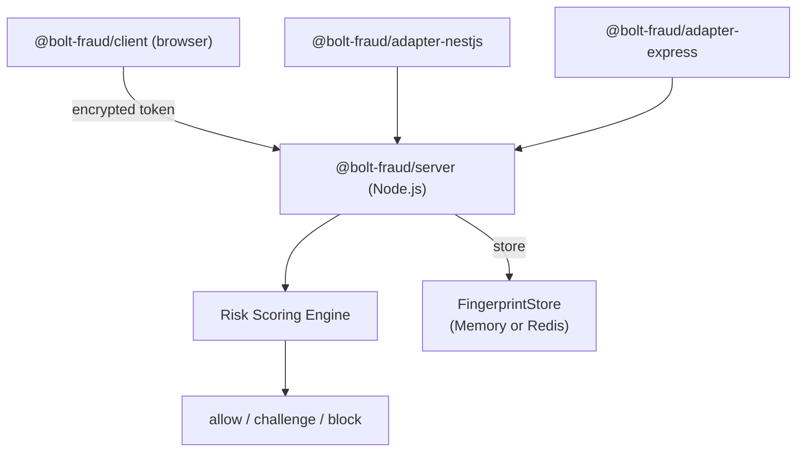

# bolt-fraud Project Conventions

## Overview

Anti-bot detection system. TypeScript monorepo with 4 packages: client SDK (browser), server core (Node.js), NestJS adapter, Express adapter.

## Architecture



- Client collects fingerprints + behavior, encrypts with AES-256-GCM + RSA-OAEP, injects via fetch/XHR hooks
- Server decrypts, runs weighted scoring engine, returns decision
- NestJS adapter wraps server in a guard + decorators
- Express adapter provides middleware with custom block/challenge handlers
- FingerprintStore supports in-memory and Redis backends

## Key Files

| File | Purpose |
|------|---------|
| `packages/client/src/index.ts` | Client public API: `init()`, `getToken()`, `destroy()` |
| `packages/client/src/types.ts` | All client-side types |
| `packages/client/src/fingerprint/` | Canvas, WebGL, audio, navigator, screen collectors |
| `packages/client/src/fingerprint/utils.ts` | Shared fingerprint utilities (arrayBufferToHex) |
| `packages/client/src/detection/` | Automation detection, integrity validation |
| `packages/client/src/behavior/` | Mouse, keyboard, scroll ring buffer trackers |
| `packages/client/src/transport/` | Binary serializer, crypto, fetch/XHR hooks |
| `packages/server/src/index.ts` | Server public API: `createBoltFraud()` |
| `packages/server/src/model/types.ts` | Core types: Token, Decision, Fingerprint, FingerprintStore |
| `packages/server/src/crypto/decrypt.ts` | Token decryption: base64url decode → RSA-OAEP unwrap → AES-256-GCM decrypt → binary deserialize |
| `packages/server/src/crypto/keys.ts` | KeyManager: load keys, get by keyId, generate key pairs (configurable RSA modulus) |
| `packages/server/src/scoring/engine.ts` | RiskEngine: orchestrate scorer chain, nonce replay protection, decision classification |
| `packages/server/src/scoring/fingerprint.ts` | FingerprintScorer: canvas/WebGL/audio hashes, hardware concurrency, screen dimensions |
| `packages/server/src/scoring/automation.ts` | AutomationScorer: instant-block signals (webdriver, framework globals), scored signals |
| `packages/server/src/scoring/behavior.ts` | BehaviorScorer: interaction detection, mouse entropy, keystroke uniformity |
| `packages/server/src/store/memory.ts` | MemoryStore: in-memory FingerprintStore (nonce + IP tracking, no TTL cleanup) |
| `packages/server/src/store/redis.ts` | RedisStore: Redis-backed FingerprintStore with TTL-based cleanup |
| `packages/adapter-nestjs/src/bolt-fraud.module.ts` | BoltFraudModule: forRoot/forRootAsync dynamic module |
| `packages/adapter-nestjs/src/bolt-fraud.guard.ts` | BoltFraudGuard: CanActivate — reads token header, calls verify, injects decision |
| `packages/adapter-nestjs/src/bolt-fraud.decorator.ts` | @BoltFraudProtected(), @BoltFraudDecision() decorators |
| `packages/adapter-express/src/middleware.ts` | boltFraudMiddleware: Express middleware factory with custom handlers |
| `packages/adapter-express/src/index.ts` | Express adapter exports: middleware, BoltFraudExpressConfig, re-exported server types |

## Commands

```bash
make install          # npm install
make test             # Run all tests (vitest)
make test-client      # Client tests only
make test-server      # Server tests only
make test-adapters    # Adapter tests (NestJS + Express)
make typecheck        # tsc --noEmit all workspaces
make build            # tsup build all packages
make clean            # rm dist/
make generate-keys    # Generate RSA key pair in keys/
```

## Testing

- Framework: **Vitest** in all packages
- Client tests use `jsdom` environment (browser API mocking)
- Server tests use Node.js environment
- Adapter tests (NestJS + Express) use Node.js environment
- Mock factories in `tests/helpers.ts` per package
- 512+ tests across 4 packages, 80%+ coverage

### Known jsdom Limitations

- `navigator.webdriver` doesn't exist — use `Object.defineProperty` instead of `vi.spyOn`
- `performance.now` and `XMLHttpRequest.prototype.open` aren't native — skip `isNativeFunction` checks in jsdom

## Conventions

- **ESM** — `"type": "module"`, imports use `.js` extensions
- **Immutable types** — all interfaces use `readonly`, never mutate
- **Dual output** — tsup builds CJS + ESM
- **Zero dependencies** — client and server packages have no runtime deps; adapters depend on server
- **Package boundaries** — client depends on nothing; server depends on nothing; both adapters depend on server
- **Peer dependencies** — RedisStore has ioredis as peerDep (dynamic require for zero-dep default); Express adapter has express as peerDep
- **Types** — server types are canonical (`model/types.ts`); client has own browser-specific types
- **Scorer plugins** — implement `Scorer` interface with `name` property and `score()` method
- **Scoring reasons** — use snake_case: `canvas_fingerprint_empty_or_zero`, `no_interaction_events`, `languages_empty`, `connection_rtt_zero`
- **Instant-block reasons** — prefixed: `instant_block:webdriver_present`, `instant_block:native_function_toString_overridden`
- **Event types** — in server, use `Bf` prefix: `BfMouseEvent`, `BfKeyboardEvent`, `BfScrollEvent`
- **Key rotation** — `keyId` byte (u8) in first byte of token bundle for multi-key support

## Scoring Engine

Signals are scored independently then summed. Instant-block signals bypass scoring.

- Block threshold: 70 (configurable)
- Challenge threshold: 30 (configurable)
- Instant-block signals: `webdriver_present`, `puppeteer_runtime`, `playwright_runtime`, `selenium_runtime`, `phantom_runtime`, prototype chain tampered, native toString overridden
- Nonce replay is instant-blocked. Tokens older than 5 minutes are instant-blocked.

## Encryption Pipeline

```
Client:
  payload → binary serialize → deflate-raw compress → AES-256-GCM encrypt (random IV)
  → RSA-OAEP wrap AES key with server public key → bundle: [u8 keyId][u16 wrappedKeyLen][wrappedKey][12B IV][ciphertext+authTag]
  → base64url encode

Server:
  base64url decode → parse [u8 keyId] from first byte → lookup private key by keyId
  → RSA-OAEP unwrap AES key → AES-256-GCM decrypt with parsed IV
  → tryDecompress (deflate-raw) → binary deserialize → validate Token shape
```

Bundle wire format: `[1B keyId][2B wrappedKeyLen BE][wrappedKey bytes][12B random IV][ciphertext + 16B GCM authTag]`

## CI/CD

### GitHub Actions Workflows

**CI Pipeline** (`.github/workflows/ci.yml`):
- Runs on every push to `main` and all PRs
- Tests on Node.js 18 and 20
- Typechecks client, server, adapters in parallel
- Runs full test suite (client, server, adapters)
- Builds all packages only on main push (PRs skip full build)
- Cancels in-progress runs for the same branch

**Release Workflow** (`.github/workflows/release.yml`):
- Manual trigger: `gh workflow run release.yml -f bump=patch|minor|major`
- Checks out repo with full history for version bumping
- Typechecks all packages
- Runs full test suite
- Builds all packages
- Bumps versions in all package.json files atomically
- Runs `npm pack --dry-run` to verify publishable artifacts
- Commits version bump and tags with `v<version>`
- Pushes commit and tags to origin (npm publish not included — manual for now)
