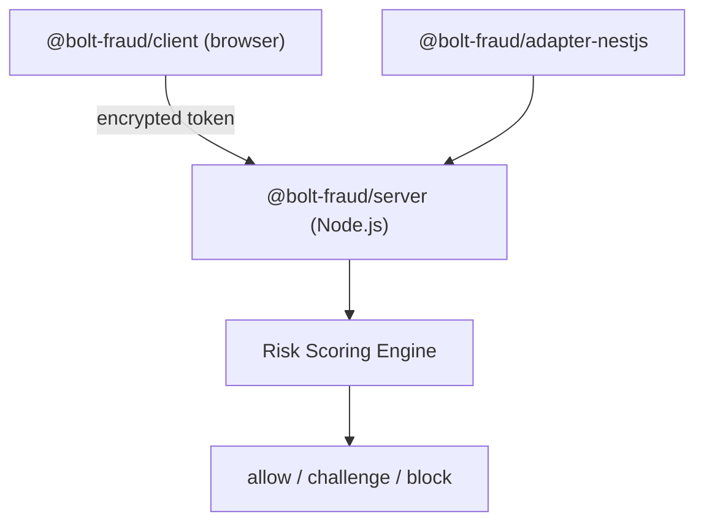

# bolt-fraud Project Conventions

## Overview

Anti-bot detection system. TypeScript monorepo with 3 packages: client SDK (browser), server core (Node.js), NestJS adapter.

## Architecture



- Client collects fingerprints + behavior, encrypts with AES-256-GCM + RSA-OAEP, injects via fetch/XHR hooks
- Server decrypts, runs weighted scoring engine, returns decision
- NestJS adapter wraps server in a guard + decorators

## Key Files

| File | Purpose |
|------|---------|
| `packages/client/src/index.ts` | Client public API: `init()`, `getToken()`, `destroy()` |
| `packages/client/src/types.ts` | All client-side types |
| `packages/client/src/fingerprint/` | Canvas, WebGL, audio, navigator, screen collectors |
| `packages/client/src/detection/` | Automation detection, integrity validation |
| `packages/client/src/behavior/` | Mouse, keyboard, scroll ring buffer trackers |
| `packages/client/src/transport/` | Binary serializer, crypto, fetch/XHR hooks |
| `packages/server/src/index.ts` | Server public API: `createBoltFraud()` |
| `packages/server/src/model/types.ts` | Core types: Token, Decision, Fingerprint, FingerprintStore |
| `packages/server/src/crypto/decrypt.ts` | Token decryption (AES-GCM + RSA-OAEP unwrap + binary deserializer) |
| `packages/server/src/crypto/keys.ts` | Key generation and management |
| `packages/server/src/scoring/engine.ts` | `RiskEngine` class — orchestrates all scoring |
| `packages/server/src/scoring/fingerprint.ts` | Fingerprint consistency scoring |
| `packages/server/src/scoring/automation.ts` | Automation detection scoring + instant-block |
| `packages/server/src/scoring/behavior.ts` | Behavioral analysis (entropy, timing) |
| `packages/server/src/store/memory.ts` | In-memory FingerprintStore implementation |
| `packages/adapter-nestjs/src/bolt-fraud.module.ts` | NestJS DynamicModule (forRoot/forRootAsync) |
| `packages/adapter-nestjs/src/bolt-fraud.guard.ts` | CanActivate guard — reads x-client-data, calls verify |
| `packages/adapter-nestjs/src/bolt-fraud.decorator.ts` | @Protected(), @BoltFraudDecision() decorators |

## Commands

```bash
make install          # npm install
make test             # Run all tests (vitest)
make test-client      # Client tests only
make test-server      # Server tests only
make typecheck        # tsc --noEmit all workspaces
make build            # tsup build all packages
make clean            # rm dist/
make generate-keys    # Generate RSA key pair in keys/
```

## Testing

- Framework: **Vitest** in all packages
- Client tests use `jsdom` environment (browser API mocking)
- Server tests use Node.js environment
- Mock factories in `tests/helpers.ts` per package
- 240+ tests across 3 packages

### Known jsdom Limitations

- `navigator.webdriver` doesn't exist — use `Object.defineProperty` instead of `vi.spyOn`
- `performance.now` and `XMLHttpRequest.prototype.open` aren't native — skip `isNativeFunction` checks in jsdom

## Conventions

- **ESM** — `"type": "module"`, imports use `.js` extensions
- **Immutable types** — all interfaces use `readonly`, never mutate
- **Dual output** — tsup builds CJS + ESM
- **Zero dependencies** — client and server packages have no runtime deps
- **Package boundaries** — client depends on nothing; server depends on nothing; adapter-nestjs depends on server
- **Types** — server types are canonical (`model/types.ts`); client has its own browser-specific types
- **Scoring reasons** — use snake_case names: `canvas_fingerprint_empty_or_zero`, `no_interaction_events`
- **Instant-block reasons** — prefixed: `instant_block:webdriver_present`

## Scoring Engine

Signals are scored independently then summed. Instant-block signals bypass scoring.

- Block threshold: 70 (configurable)
- Challenge threshold: 30 (configurable)
- Instant-block signals: `webdriver_present`, `puppeteer_runtime`, `playwright_runtime`, `selenium_runtime`, `phantom_runtime`, prototype chain tampered, native toString overridden

## Encryption Pipeline

```
Client: payload → binary serialize → AES-256-GCM encrypt → RSA-OAEP wrap key → base64url encode
Server: base64url decode → RSA-OAEP unwrap key → AES-256-GCM decrypt → binary deserialize
```
