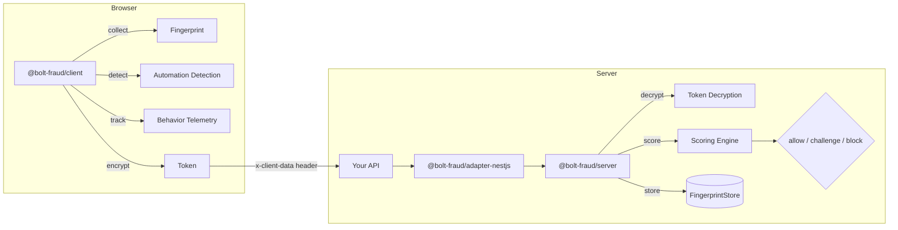

# bolt-fraud

Full-stack anti-bot detection system. Collects device fingerprints, detects automation tools, analyzes behavioral signals, and scores risk — all transparent to application code.

## Architecture



## Packages

| Package | Description |
|---------|-------------|
| `@bolt-fraud/client` | Browser SDK — fingerprinting, automation detection, behavioral telemetry, encryption |
| `@bolt-fraud/server` | Server core — decryption, risk scoring engine, fingerprint store |
| `@bolt-fraud/adapter-nestjs` | NestJS integration — module, guard, decorators |

## Quick Start

### 1. Install

```bash
# Client SDK (browser)
npm install @bolt-fraud/client

# Server (Node.js)
npm install @bolt-fraud/server

# NestJS adapter
npm install @bolt-fraud/adapter-nestjs
```

### 2. Generate RSA Keys

```bash
make generate-keys
# Creates keys/private.pem and keys/public.pem
```

### 3. Client SDK

```typescript
import { init, getToken } from '@bolt-fraud/client'

await init({
  serverUrl: 'https://api.example.com',
  publicKey: RSA_PUBLIC_KEY_PEM,
  hookFetch: true,  // auto-inject tokens into fetch() requests
})

// Tokens are automatically injected via fetch hook.
// Or manually:
const { token } = await getToken()
```

The SDK automatically:
- Collects canvas, WebGL, audio, navigator, and screen fingerprints
- Detects Puppeteer, Playwright, Selenium, and PhantomJS
- Validates browser API integrity (prototype chains, native functions)
- Tracks mouse, keyboard, and scroll behavior in ring buffers
- Serializes to compact binary, encrypts with AES-256-GCM + RSA-OAEP
- Injects `x-client-data` header into outgoing requests

### 4. Server Verification

```typescript
import { createBoltFraud } from '@bolt-fraud/server'
import fs from 'node:fs'

const bf = createBoltFraud({
  privateKeyPem: fs.readFileSync('keys/private.pem', 'utf-8'),
  publicKeyPem: fs.readFileSync('keys/public.pem', 'utf-8'),
  blockThreshold: 70,
  challengeThreshold: 30,
  // Optional:
  // ipCountThreshold: 100,    // IPs per fingerprint before penalty
  // maxTokenAgeMs: 30_000,    // Token age penalty window
  // maxTokenAbsoluteAgeMs: 300_000,  // Hard token expiry (instant block)
})

// In your request handler:
const decision = await bf.verify(req.headers['x-client-data'], req.ip)

if (decision.decision === 'block') {
  return res.status(403).json({ error: 'blocked' })
}
if (decision.decision === 'challenge') {
  return res.status(429).json({ error: 'captcha_required' })
}
```

### 5. NestJS Integration

```typescript
import { Module } from '@nestjs/common'
import { BoltFraudModule } from '@bolt-fraud/adapter-nestjs'

@Module({
  imports: [
    BoltFraudModule.forRoot({
      privateKeyPem: process.env.RSA_PRIVATE_KEY,
      publicKeyPem: process.env.RSA_PUBLIC_KEY,
    }),
  ],
})
export class AppModule {}
```

Protect routes with the guard:

```typescript
import { Controller, Get } from '@nestjs/common'
import { BoltFraudProtected, BoltFraudDecision } from '@bolt-fraud/adapter-nestjs'
import type { Decision } from '@bolt-fraud/server'

@Controller('api')
export class ApiController {
  @Get('protected')
  @BoltFraudProtected()
  handler(@BoltFraudDecision() decision: Decision) {
    // decision.score, decision.reasons, etc.
    return { status: 'ok', riskScore: decision.score }
  }
}
```

## Scoring Engine

| Signal | Weight | Instant Block? |
|--------|--------|----------------|
| `webdriver_present` | - | Yes |
| `puppeteer_runtime` | - | Yes |
| `playwright_runtime` | - | Yes |
| `selenium_runtime` | - | Yes |
| `phantom_runtime` | - | Yes |
| Prototype chain tampered | - | Yes |
| Native `toString()` overridden | - | Yes |
| Canvas fingerprint empty/zero | +25 | No |
| WebGL fingerprint empty | +25 | No |
| Audio fingerprint empty/zero | +20 | No |
| Stack trace contains headless keywords | +15 | No |
| User-Agent claims headless browser | +20 | No |
| No mouse/keyboard events | +15 | No |
| Mouse entropy too low | +15 | No |
| Keystroke timing too uniform | +10 | No |
| Token older than 30s | +10 | No |
| `hardwareConcurrency === 0` | +5 | No |
| Fingerprint seen from 100+ IPs | +5 | No |
| Token nonce replayed | - | Yes |
| Token expired (>5min) | - | Yes |

**Thresholds** (configurable):
- Score < 30: **Allow**
- Score 30-70: **Challenge** (CAPTCHA)
- Score > 70 or instant-block: **Block**

## Development

```bash
make install        # Install dependencies
make test           # Run all tests
make test-client    # Client tests only
make test-server    # Server tests only
make typecheck      # Type-check all packages
make build          # Build all packages
make clean          # Remove dist directories
```

## License

Private.
