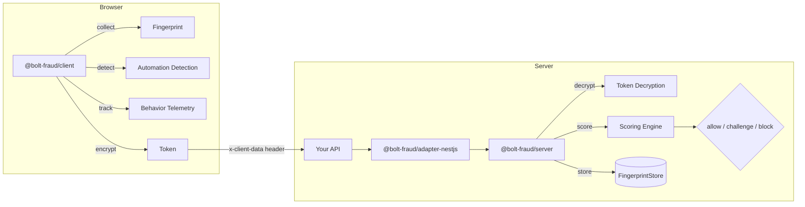

# bolt-fraud

Full-stack anti-bot detection system. Collects device fingerprints, detects automation tools, analyzes behavioral signals, and scores risk — all transparent to application code.

## Architecture



## Packages

| Package | Description |
|---------|-------------|
| `@bolt-fraud/client` | Browser SDK — fingerprinting, automation detection, behavioral telemetry, encryption |
| `@bolt-fraud/server` | Server core — decryption, risk scoring engine, fingerprint store |
| `@bolt-fraud/adapter-nestjs` | NestJS integration — module, guard, decorators |

## Quick Start

### 1. Install

```bash
# Client SDK (browser)
npm install @bolt-fraud/client

# Server (Node.js)
npm install @bolt-fraud/server

# NestJS adapter
npm install @bolt-fraud/adapter-nestjs
```

### 2. Generate RSA Keys

```bash
make generate-keys
# Creates keys/private.pem (2048-bit RSA) and keys/public.pem
```

To use a different key size:

```typescript
import { generateKeyPairAsync } from '@bolt-fraud/server'

// 4096-bit RSA (slower, more secure)
const keys = await generateKeyPairAsync(4096)
```

### 3. Client SDK

```typescript
import { init, getToken } from '@bolt-fraud/client'

await init({
  serverUrl: 'https://api.example.com',
  publicKey: RSA_PUBLIC_KEY_PEM,
  keyId: 0,                    // Key ID (default: 0)
  hookFetch: true,             // auto-inject tokens into fetch() requests
  hookXHR: false,              // also intercept XMLHttpRequest
  tokenHeader: 'x-client-data' // custom header name
})

// Tokens are automatically injected via fetch hook.
// Or manually:
const encryptedToken = await getToken()
// Returns: { token: "...", v: 1 }
```

The SDK automatically:
- Collects canvas, WebGL, audio, navigator, and screen fingerprints
- Detects Puppeteer, Playwright, Selenium, and PhantomJS
- Validates browser API integrity (prototype chains, native functions)
- Tracks mouse, keyboard, and scroll behavior in ring buffers
- Serializes to compact binary, compresses with deflate-raw, encrypts with AES-256-GCM + RSA-OAEP key wrapping
- Injects encrypted token into HTTP headers

### 4. Server Verification

```typescript
import { createBoltFraud, toClientSafeDecision } from '@bolt-fraud/server'
import fs from 'node:fs'

const bf = createBoltFraud({
  privateKeyPem: fs.readFileSync('keys/private.pem', 'utf-8'),
  publicKeyPem: fs.readFileSync('keys/public.pem', 'utf-8'),
  blockThreshold: 70,          // default
  challengeThreshold: 30,      // default
  // Optional key rotation:
  additionalKeys: [
    { keyId: 1, publicKeyPem: '...', privateKeyPem: '...' }
  ]
})

// In your request handler:
const decision = await bf.verify(req.headers['x-client-data'], req.ip)

if (decision.decision === 'block') {
  // Return decision.score, decision.reasons for logging
  return res.status(403).json({ error: 'blocked' })
}
if (decision.decision === 'challenge') {
  // Prompt user for CAPTCHA
  return res.status(429).json({ error: 'captcha_required' })
}

// For client-side decision responses (never expose score/reasons):
const clientDecision = toClientSafeDecision(decision)
// Only contains: { decision: 'allow' | 'challenge' | 'block' }
```

### 5. NestJS Integration

```typescript
import { Module } from '@nestjs/common'
import { BoltFraudModule } from '@bolt-fraud/adapter-nestjs'

@Module({
  imports: [
    BoltFraudModule.forRoot({
      privateKeyPem: process.env.RSA_PRIVATE_KEY,
      publicKeyPem: process.env.RSA_PUBLIC_KEY,
      tokenHeader: 'x-client-data', // optional
    }),
  ],
})
export class AppModule {}
```

Protect routes with the guard:

```typescript
import { Controller, Get } from '@nestjs/common'
import { BoltFraudProtected, BoltFraudDecision } from '@bolt-fraud/adapter-nestjs'
import type { Decision } from '@bolt-fraud/server'

@Controller('api')
export class ApiController {
  @Get('protected')
  @BoltFraudProtected()
  handler(@BoltFraudDecision() decision: Decision) {
    // decision.score, decision.reasons (internal, never expose to client)
    // decision.instantBlock (whether an instant-block signal was detected)
    return { status: 'ok' }
  }
}
```

## Scoring Engine

### Instant-Block Signals

These trigger immediate block (score=100, instantBlock=true):

| Signal | Detection |
|--------|-----------|
| `webdriver_present` | `navigator.webdriver === true` |
| `puppeteer_runtime` | Global `window.__puppeteer_evaluation_script__` detected |
| `playwright_runtime` | Global `window.__playwright` detected |
| `selenium_runtime` | Multiple Selenium global patterns detected |
| `phantom_runtime` | Global `window._phantom` detected |
| Prototype chain tampered | DOM chain validation failed |
| Native `toString()` overridden | `Function.prototype.toString` patched |
| Token nonce replayed | Same nonce within 60s TTL |
| Token expired | Age > 5 minutes |

### Scored Signals (Contribute to Risk Score)

| Signal | Weight | Detection |
|--------|--------|-----------|
| Canvas fingerprint empty/zero | +25 | Hash is empty string or '0' |
| WebGL fingerprint empty | +25 | Hash is empty string or '0' |
| Audio fingerprint empty/zero | +20 | Hash is empty string or '0' |
| Stack trace headless keywords | +15 | Stack contains "headless", "puppeteer", "playwright", etc. |
| User-Agent headless | +20 | UA contains "HeadlessChrome" or "PhantomJS" |
| Languages empty | +10 | `navigator.languages.length === 0` |
| Connection RTT zero | +10 | `navigator.connection.rtt === 0` |
| No interaction events | +15 | No mouse or keyboard events collected |
| Mouse entropy too low | +15 | Entropy < 0.1 (linear paths) |
| Keystroke uniformity too high | +10 | Uniformity > 0.95 (fixed timing) |
| Token too old | +10 | Age > 30s (replay or latency) |
| Hardware concurrency zero | +5 | `navigator.hardwareConcurrency === 0` |
| Fingerprint multi-IP abuse | +5 | Same fingerprint from 100+ IPs |

**Decision Thresholds** (configurable):
- Score < 30: **Allow**
- Score 30-70: **Challenge** (CAPTCHA)
- Score ≥ 70 or instant-block: **Block**

## Custom Scorers

Extend the risk engine with custom scoring logic:

```typescript
import { RiskEngine, type Scorer, type ScorerResult, type ScoringContext } from '@bolt-fraud/server'
import type { Token } from '@bolt-fraud/server'

class CustomScorer implements Scorer {
  readonly name = 'custom'
  score(token: Token, context: ScoringContext): ScorerResult {
    // Custom logic here
    return {
      score: 5,
      reasons: ['custom_signal_detected'],
      instantBlock: false
    }
  }
}

const engine = new RiskEngine({
  scorers: [
    // Built-in scorers...
    new CustomScorer(),
  ]
})
```

## Key Rotation

To rotate RSA keys without downtime:

1. Generate a new key pair: `make generate-keys`
2. Deploy server with `additionalKeys` containing both old and new private keys
3. Update client SDK with the new public key and corresponding `keyId`
4. After a grace period (24h), remove the old key from `additionalKeys`

The server automatically routes decryption to the correct key based on the keyId byte in the token.

## Development

```bash
make install        # Install dependencies
make test           # Run all tests (vitest)
make test-client    # Client tests only
make test-server    # Server tests only
make typecheck      # Type-check all packages (tsc --noEmit)
make build          # Build all packages (tsup)
make clean          # Remove dist directories
make generate-keys  # Generate RSA key pair
```

## License

Private.
