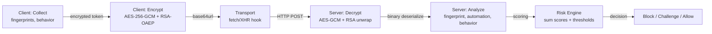
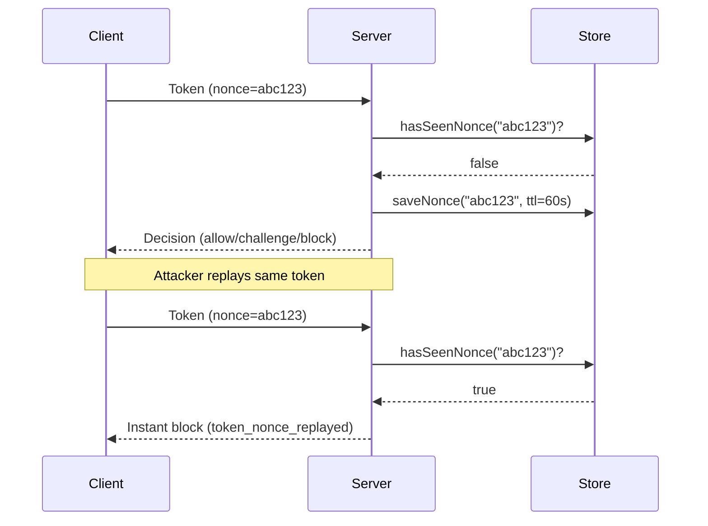
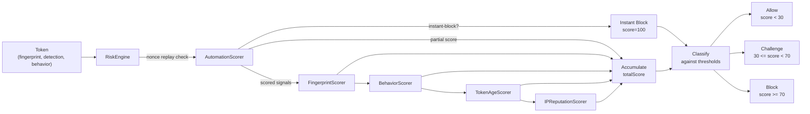
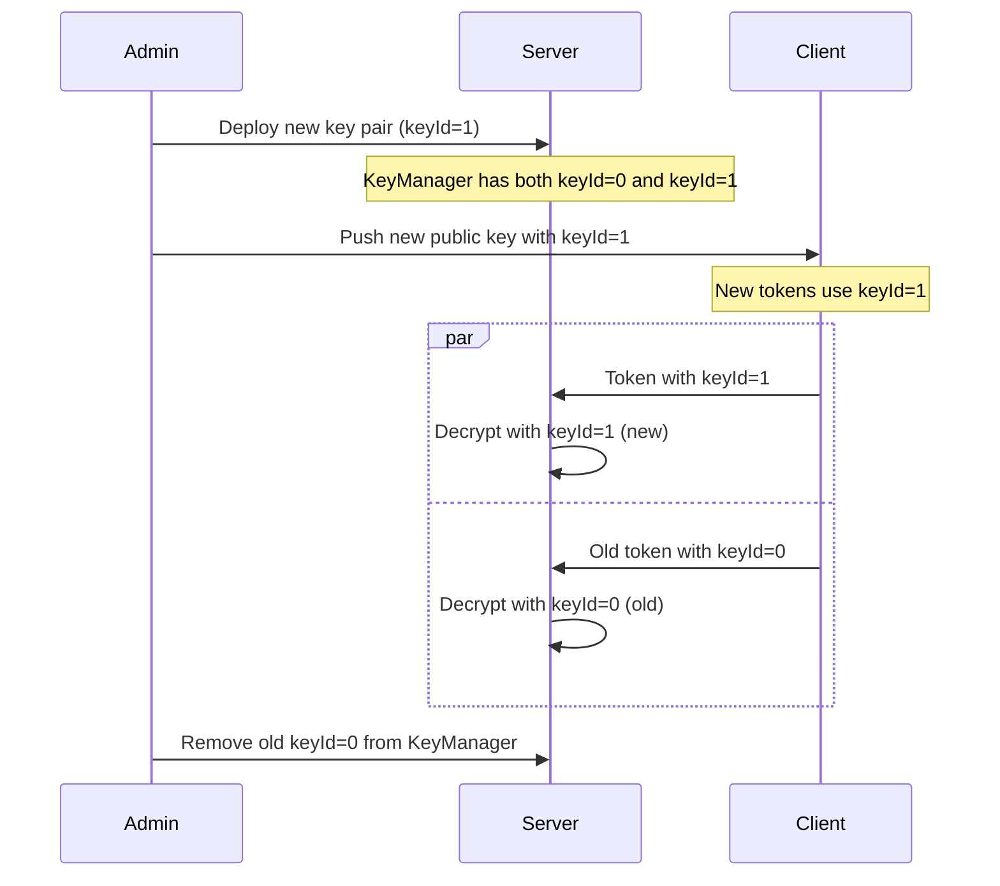

# Bolt Fraud Detection Algorithms

This document explains the mathematical and technical foundations of the Bolt anti-bot detection system. Understanding these algorithms helps you evaluate detection accuracy, configure thresholds appropriately, and identify potential evasion techniques.

## 1. Overview and Pipeline

The Bolt detection system operates in a multi-stage pipeline:



### Data Flow

1. **Collection (Client)**: Periodically collect fingerprints (canvas, WebGL, audio), automation signals, and user interactions (mouse, keyboard, scroll) into a ring buffer.
2. **Serialization (Client)**: Binary-serialize the payload using a compact format with specific field orderings.
3. **Encryption (Client)**: Wrap the AES-256-GCM symmetric key with the server's public RSA-2048 key (RSA-OAEP), then AES-GCM encrypt the payload with a random IV.
4. **Transport (Client)**: Inject the encrypted token into HTTP headers via fetch/XHR hooks. Token is sent with every request to track state.
5. **Decryption (Server)**: Unwrap the RSA-encrypted AES key, then decrypt the GCM ciphertext with the original IV.
6. **Scoring (Server)**: Analyze three domains in parallel: fingerprint consistency, automation signals, behavioral patterns.
7. **Decision (Server)**: Sum scores, classify against thresholds, and return allow/challenge/block.

### Token Lifecycle

- **Freshness window**: Tokens older than 30 seconds are suspect (potential replay) and incur a +10 score penalty.
- **Future tokens**: Tokens with timestamps more than 5 seconds in the future trigger an instant block (clock skew or fraud).
- **Token size**: Approximately 1-3 KB when encrypted depending on interaction history.

### Token Nonce Replay Protection

Each token includes a cryptographically random nonce (16 bytes, base64url-encoded). The server tracks seen nonces in the `FingerprintStore` with a 60-second TTL.



A replayed nonce results in an **instant block** with reason `token_nonce_replayed`, regardless of the token's risk score.

## 2. Fingerprinting Algorithms

Device fingerprinting leverages hardware-level rendering pipelines to create stable, device-unique identifiers. Each fingerprint collector targets a different hardware layer.

### 2.1 Canvas Fingerprinting

**What it collects**: A deterministic 2D graphics rendering that exploits GPU subpixel rasterization differences.

**Algorithm**:
1. Create a 400x200 canvas (OffscreenCanvas in workers, HTMLCanvasElement as fallback)
2. Render a complex scene with:
   - Colored rectangles with alpha blending
   - Arcs and curves (quadratic bezier)
   - Linear gradient fills with 4+ color stops
   - Multi-font text (Arial, Times New Roman, Courier New) with specific UTF-8 test strings
3. Convert rendered pixels to PNG data URL via `toDataURL()` or `convertToBlob()`
4. SHA-256 hash the resulting PNG bytes
5. Return hex-encoded hash

**Why it's unique per device**:
- GPU rendering pipelines apply subpixel antialiasing, dithering, and rounding differently across vendors (NVIDIA, AMD, Intel)
- Operating system graphics subsystem (Quartz, GDI, X11) apply their own gamma correction and font rendering
- Font rendering engines (CoreText, DirectWrite, FreeType) produce character shapes unique to each OS
- Combined effect: the same scene on two different systems produces observably different pixel values even after PNG compression

**Hash example**:
```
canvas.hash = "a7f2e4c1b9d6f3a2c8e1b4d7f0a3c6e9d2f5a8b1c4e7a0d3f6b9e2c5f8a1d4"
```

**Limitations**:
- Headless browsers (Chrome, Firefox in headless mode) often report empty or zero hashes
- Privacy extensions (Brave Shields, uBlock Origin) may block canvas access → empty hash
- Cross-origin iframes throw SecurityError on `toDataURL()` → empty hash
- Tor browser intentionally returns zero canvas
- VMs and sandboxed environments may have consistent but unusual pixel values

**Scoring**: Empty or '0' hash adds +25 points (strong bot signal).

### 2.2 WebGL Fingerprinting

**What it collects**: GPU vendor/renderer strings + a custom shader render hash.

**Algorithm**:
1. Create a 64x64 WebGL canvas (supports WebGL2, WebGL, and experimental-webgl)
2. Compile custom vertex and fragment shaders:
   - Vertex: simple pass-through, outputs position
   - Fragment: outputs fixed RGBA values (pi, e, sqrt(2) as normalized floats: 0.314, 0.271, 0.141)
3. Draw a colored triangle using the shader program
4. Call `gl.readPixels()` to read the 64x64x4 byte buffer (16,384 bytes)
5. SHA-256 hash the raw pixel buffer
6. Retrieve metadata:
   - `gl.getParameter(gl.RENDERER)` — GPU model (e.g., "ANGLE (Intel UHD Graphics 630)")
   - `gl.getParameter(gl.VENDOR)` — GPU vendor (e.g., "Google Inc. (ANGLE)")
   - Request WEBGL_debug_renderer_info extension for unmasked values
   - Collect supported WebGL extensions (up to 32)

**Why it's unique per device**:
- GPU floating-point rasterization produces hardware-specific numerical precision
- Pixel values depend on GPU ISA, texture filtering implementation, and rounding modes
- GPU vendor/renderer strings leak exact model information
- Driver version affects supported extensions list

**Metadata example**:
```json
{
  "hash": "f7a2c9e1b4d6a3f8c1e4b7d0a3f6c9e2",
  "renderer": "ANGLE (Intel UHD Graphics 630)",
  "vendor": "Google Inc. (ANGLE)",
  "version": "WebGL 1.0",
  "extensions": ["OES_texture_float", "EXT_color_buffer_float", ...]
}
```

**Limitations**:
- Headless Chrome and Firefox often report empty renderer strings
- ANGLE (Chromium's WebGL implementation) abstracts the actual GPU, reporting generic values
- Tor browser blocks WebGL entirely
- Some privacy extensions disable WebGL
- VM guests may report virtual GPU drivers or no WebGL support

**Scoring**: Empty hash or renderer string adds +25 points.

### 2.3 Audio Fingerprinting

**What it collects**: Audio hardware rounding behavior from an oscillator + dynamics compressor.

**Algorithm**:
1. Create an OfflineAudioContext (1-channel mono, 44100 Hz, 1 second = 44,100 samples)
2. Create an OscillatorNode set to triangle wave at 10 kHz
3. Create a DynamicsCompressor with specific settings:
   - Threshold: -50 dB
   - Knee: 40 dB
   - Ratio: 12:1
   - Attack: 0 ms
   - Release: 0.25 s
4. Connect: Oscillator → Compressor → Destination
5. Render the audio (44,100 samples)
6. Extract a stable slice (samples 4500 to 5000 = 500 samples)
7. Interpret slice as raw bytes and SHA-256 hash
8. Return hex-encoded hash

**Why it's unique per device**:
- Audio hardware applies rounding differently (IEEE 754 single-precision, platform-specific DSP)
- Compressor parameters interact with the hardware's floating-point implementation
- The specific frequency (10 kHz) and waveform (triangle) create compression artifacts unique to each audio device

**Limitations**:
- OfflineAudioContext is blocked in some environments (sandboxed iframes, privacy-restrictive contexts)
- Audio context may be suspended in certain browser states
- Virtual audio drivers (in VMs) may return zero or constant audio
- Some headless browsers don't support audio APIs at all

**Scoring**: Empty or '0' hash adds +20 points.

### 2.4 Navigator and Screen Fingerprinting

**What it collects**: Browser and system metadata that varies across devices.

**Fields collected**:
- **userAgent**: Full user-agent string (parsed by server for browser/OS info)
- **language**: Preferred language (ISO 639-1 code like "en-US")
- **languages**: Array of preferred languages
- **hardwareConcurrency**: Logical CPU count (navigator.hardwareConcurrency, 0 in headless/VMs)
- **deviceMemory**: RAM in GB (navigator.deviceMemory, often null)
- **maxTouchPoints**: Touch screen support (0 = mouse-only, >0 = touch screen)
- **cookieEnabled**: Boolean flag for cookie support
- **pluginCount**: Number of browser plugins (deprecated, mostly 0)
- **screen.width/height**: CSS pixel dimensions
- **screen.availWidth/availHeight**: Available dimensions (exclude taskbars)
- **screen.colorDepth**: Bits per pixel (8, 16, 24, 32)
- **screen.pixelDepth**: Physical bits per pixel (usually equals colorDepth)
- **screen.devicePixelRatio**: DPR, ratio of physical to CSS pixels

**Why it matters**:
- hardwareConcurrency = 0 is common in headless browsers and VMs
- Mismatches between userAgent and rendering capabilities signal bot-like spoofing (e.g., "Intel i9" UA but hardwareConcurrency = 1)
- Device memory helps identify synthetic environments (often report unrealistic values)

**Scoring rules**:
- hardwareConcurrency = 0 → +5 points
- devicePixelRatio = 1.0 AND screen.width > 1920 → +5 points (headless Chrome default)
- Screen dimensions all 0 → +10 points (headless browsers)

## 3. Automation Detection

Automation frameworks (Puppeteer, Playwright, Selenium, PhantomJS) leave detectable footprints in the browser environment. Bolt checks for these signals in a multi-layered approach.

### 3.1 Instant-Block Signals

These signals trigger an immediate block regardless of other scores.

| Signal | Detection Method | Why It's Reliable |
|--------|-----------------|-------------------|
| `webdriver_present` | Check `navigator.webdriver === true` | WebDriver API standard, set by ChromeDriver/GeckoDriver, not forged by real browsers |
| `puppeteer_runtime` | Check for `window.__puppeteer_evaluation_script__` | Puppeteer injects this global before script execution, not present in real browsers |
| `playwright_runtime` | Check for `window.__playwright` or `window._playwrightInstance` | Playwright's internal globals, unique to the framework |
| `selenium_runtime` | Check for `window._selenium`, `window.__webdriver_evaluate`, `window.domAutomation*`, etc. | Multiple Selenium versions inject different globals, all indicate automation |
| `phantom_runtime` | Check for `window._phantom` or `window.callPhantom` | PhantomJS injects these for script communication |

**Detection code**:
```typescript
const hasPuppeteer = typeof window['__puppeteer_evaluation_script__'] !== 'undefined'
const hasPlaywright = typeof window['__playwright'] !== 'undefined'
const hasSelenium = typeof window['_selenium'] !== 'undefined'
const hasPhantom = typeof window['_phantom'] !== 'undefined'
```

### 3.2 Scored Signals

These signals contribute to the overall risk score but don't trigger instant block alone.

| Signal | Detection Method | Score | Why It Matters |
|--------|-----------------|-------|----------------|
| `languages_empty` | Check `navigator.languages.length === 0` | +10 | Real browsers always have at least one language. Bots often have none. |
| `connection_rtt_zero` | Check `navigator.connection.rtt === 0` | +10 | Zero round-trip time is unphysical on real networks. Headless network stacks report this. |
| `stack_trace_headless` | Capture stack trace, check for "puppeteer", "playwright", "selenium", "webdriver" strings | +15 | Stack frames leak framework names during automation calls. |
| `user_agent_headless` | Regex test for "HeadlessChrome" or "PhantomJS" in user-agent | +20 | Headless mode is often explicitly named in the UA string. |

### 3.3 Integrity Violations

Automation frameworks patch native functions to intercept calls. Bolt validates that critical native functions haven't been overridden.

| Violation | Check | Instant Block? | Why It Matters |
|-----------|-------|----------------|----------------|
| `native_function_toString_overridden` | Call `Function.prototype.toString.call(Function.prototype.toString)` and check for '[native code]' | Yes | If toString itself is patched, all downstream isNativeFunction checks are unreliable. A framework patching this is trying to hide other patches. |
| `window_event_target_chain_broken` | Verify `Object.getPrototypeOf(Window.prototype) === EventTarget.prototype` | Yes | DOM prototype chain shouldn't be modified. Frameworks that break this are attempting deep API hijacking. |
| `document_node_chain_broken` | Verify `Object.getPrototypeOf(Document.prototype) === Node.prototype && Object.getPrototypeOf(Node.prototype) === EventTarget.prototype` | Yes | DOM tree prototype chain shouldn't be modified. Breaking this is a strong indicator of framework-level hooking. |
| `fetch_native_overridden` | Use `isNativeFunction(window.fetch)` | No (scored) | Frameworks patch fetch to intercept requests. Not instant-block because some legitimate tools do this. |
| `xhr_open_overridden` | Use `isNativeFunction(XMLHttpRequest.prototype.open)` | No (scored) | XHR interception is common in frameworks. |
| `date_now_overridden` | Use `isNativeFunction(Date.now)` | No (scored) | Some frameworks mock time. |
| `performance_now_overridden` | Use `isNativeFunction(performance.now)` | No (scored) | Performance timing is sometimes mocked. |

**Native function check**:
```typescript
function isNativeFunction(fn) {
  try {
    const src = Function.prototype.toString.call(fn)
    return src.includes('[native code]')
  } catch {
    return false // Assume non-native if check throws
  }
}
```

The check catches any function where `toString()` doesn't claim to be `[native code]`, which indicates user-land JavaScript patching.

## 4. Behavioral Analysis Algorithms

Behavioral analysis detects bot-like interaction patterns by analyzing mouse movements and keystroke timing.

### 4.1 Mouse Entropy Algorithm

**Purpose**: Detect linear, predictable mouse movement (bot-like) vs. random human-like movement.

**Algorithm**:

1. Collect mouse move events with (x, y, t) coordinates and calculate angle changes between consecutive positions.
2. Normalize angles to [0, 2π] range.
3. Bin each angle into one of 8 equal sectors (each 45° wide = π/4 radians).
4. Compute Shannon entropy across bins.
5. Normalize entropy to [0, 1] scale.

**Step-by-step**:

```
Input: mouse events = [{x:100, y:50, t:1000}, {x:120, y:60, t:1010}, {x:135, y:75, t:1020}, ...]

Step 1: Calculate angles
  angle[0] = atan2(60-50, 120-100) = atan2(10, 20) ≈ 0.464 rad (≈ 26.6°)
  angle[1] = atan2(75-60, 135-120) = atan2(15, 15) ≈ 0.785 rad (≈ 45°)

Step 2: Normalize to [0, 2π]
  normalized[0] = 0.464 rad (already in [0, 2π])
  normalized[1] = 0.785 rad (already in [0, 2π])

Step 3: Map to bin index (0-7)
  binIndex = floor(normalized_angle / (2π/8)) = floor(normalized_angle / (π/4))
  binIndex[0] = floor(0.464 / 0.785) = 0 (Northeast sector)
  binIndex[1] = floor(0.785 / 0.785) = 1 (East-Northeast sector)

Step 4: Count occurrences
  bins = [2, 1, 0, 0, 0, 0, 0, 0]  (2 angles in bin 0, 1 in bin 1)
  totalAngles = 3

Step 5: Compute Shannon entropy
  p[0] = 2/3 ≈ 0.667
  p[1] = 1/3 ≈ 0.333
  entropy = -(0.667 * log2(0.667) + 0.333 * log2(0.333))
          = -(0.667 * (-0.585) + 0.333 * (-1.585))
          = 0.390 + 0.528
          = 0.918 bits

Step 6: Normalize to [0, 1]
  max_entropy = log2(8) = 3
  normalized_entropy = 0.918 / 3 ≈ 0.306
```

**Mathematical formula**:

```
H = -Σ(p_i * log₂(p_i)) / log₂(8)

where:
  p_i = count[i] / total_angles
  count[i] = number of angles in bin i
  log₂(8) = 3
  Result ∈ [0, 1]
```

**Interpretation**:
- **0.0** = All angles in one direction (perfectly linear, bot-like)
- **0.5** = Angles moderately spread across directions
- **1.0** = Angles equally distributed across all 8 directions (maximum randomness)

**Human behavior**: Humans move the mouse in many directions; entropy typically 0.4-1.0.
**Bot behavior**: Bots follow linear paths or fixed trajectories; entropy typically 0.0-0.2.

**Scoring**: entropy < 0.1 → +15 points.

### 4.2 Keystroke Timing Uniformity Algorithm

**Purpose**: Detect uniform, predictable keystroke timing (bot-like) vs. variable human timing.

**Algorithm**:

1. Collect keystroke events with timestamps (t).
2. Calculate inter-key intervals: diff[i] = t[i+1] - t[i] (milliseconds).
3. Compute mean and standard deviation of intervals.
4. Calculate coefficient of variation (CV) = stddev / mean.
5. Return uniformity = 1 - min(CV, 1).

**Step-by-step**:

```
Input: keystroke events = [{t:1000}, {t:1050}, {t:1110}, {t:1165}, {t:1210}, ...]

Step 1: Calculate intervals
  intervals = [50, 60, 55, 45]

Step 2: Compute mean
  mean = (50 + 60 + 55 + 45) / 4 = 52.5 ms

Step 3: Compute standard deviation
  variance = ((50-52.5)² + (60-52.5)² + (55-52.5)² + (45-52.5)²) / 4
           = (6.25 + 56.25 + 6.25 + 56.25) / 4
           = 31.25
  stddev = sqrt(31.25) ≈ 5.59 ms

Step 4: Coefficient of variation
  cv = 5.59 / 52.5 ≈ 0.106

Step 5: Uniformity
  uniformity = 1 - min(0.106, 1) = 0.894
```

**Mathematical formula**:

```
uniformity = 1 - min(CV, 1)

where:
  CV = stddev / mean
  stddev = sqrt(Σ(x_i - mean)² / n)
  mean = Σ(x_i) / n
  Result ∈ [0, 1]
```

**Interpretation**:
- **~1.0** = Very uniform timing (CV ≈ 0), bot-like
- **~0.7** = Moderately uniform (CV ≈ 0.3), slightly suspicious
- **~0.0** = High variation (CV > 1), human-like

**Human behavior**: Humans have variable typing speeds depending on fatigue, focus, key difficulty; CV typically 0.3-0.8 (uniformity 0.2-0.7).
**Bot behavior**: Bots use fixed delays; CV typically 0.01-0.1 (uniformity 0.9-1.0).

**Scoring**: uniformity > 0.95 → +10 points.

### 4.3 No Interaction Signal

**Purpose**: Detect bots that haven't interacted with the page.

**Check**:
```typescript
if (behavior.totalMouseEvents === 0 && behavior.totalKeyboardEvents === 0) {
  score += 15  // Strong bot signal
}
```

**Scoring**: +15 points if no mouse or keyboard events in the collection window.

## 5. Risk Scoring Engine

The risk engine orchestrates a chain of independent **Scorer** implementations and sums their results to classify the request.

### 5.1 Scorer Architecture



### 5.2 Scoring Pipeline

```
Input: Token + clientIP
  ↓
[Check Nonce Replay]
  Store.hasSeenNonce(token.nonce)?
  If yes: instant-block "token_nonce_replayed"
  ↓
[Run Scorer Chain]
  For each scorer in [AutomationScorer, FingerprintScorer, BehaviorScorer, TokenAgeScorer, IPReputationScorer]:
    result = scorer.score(token, { clientIP, store })
    if result.instantBlock:
      Save nonce, return immediately with decision=block, reasons=[...]
    else:
      totalScore += result.score
      allReasons.push(...result.reasons)
  ↓
[Save Fingerprint + Nonce]
  Store.saveFingerprint(fpHash, clientIP)
  Store.saveNonce(token.nonce, 60000ms)
  ↓
[Classify]
  if totalScore >= blockThreshold (70):  → Block
  elif totalScore >= challengeThreshold (30):  → Challenge
  else:  → Allow
```

### 5.3 Custom Scorers

Implement the `Scorer` interface to add custom logic:

```typescript
interface Scorer {
  readonly name: string
  score(token: Token, context: ScoringContext): ScorerResult | Promise<ScorerResult>
}

interface ScorerResult {
  readonly score: number
  readonly reasons: readonly string[]
  readonly instantBlock?: boolean
}
```

Pass custom scorers to `RiskEngine` constructor:

```typescript
const engine = new RiskEngine({
  scorers: [
    new AutomationScorer(),
    new FingerprintScorer(),
    new BehaviorScorer(),
    new TokenAgeScorer(30_000, 300_000),
    new IPReputationScorer(100),
    new CustomScorer(),  // User-provided
  ]
})
```

### 5.4 Score Accumulation

Each scorer returns a non-negative integer score and a list of reason strings.

**Automation scorer**:
- Returns instantly if webdriver_present or framework globals detected (score=100, instantBlock=true)
- Returns instantly if critical integrity violations detected (score=100, instantBlock=true)
- Otherwise sums scored signals (languages_empty=10, connection_rtt_zero=10)
- Maximum possible: 20 (both scored signals)

**Fingerprint scorer**:
- canvas_fingerprint_empty_or_zero: +25
- webgl_fingerprint_empty: +25
- audio_fingerprint_zero_or_empty: +20
- hardware_concurrency_zero: +5
- fingerprint_suppressed_suspicious: +10 (if both canvas+WebGL empty AND real-looking UA)
- screen_dimensions_zero: +10
- headless_default_dpr: +5
- Maximum possible: 100 (unlikely; most bots don't trigger all)

**Behavior scorer**:
- no_interaction_events: +15
- mouse_entropy_too_low: +15 (entropy < 0.1)
- keystroke_timing_too_uniform: +10 (uniformity > 0.95)
- Maximum possible: 40

**Freshness & IP scorer**:
- token_too_old (age > 30s): +10
- fingerprint_seen_from_N_ips (N > 100): +5
- Maximum possible: 15

**Default thresholds**:
```typescript
const DEFAULT_BLOCK_THRESHOLD = 70
const DEFAULT_CHALLENGE_THRESHOLD = 30
```

### 5.5 Fingerprint Hash for IP Tracking

The engine computes a stable fingerprint hash for IP reputation tracking:

```typescript
function computeFingerprintHash(token) {
  return (
    token.fingerprint.canvas.hash ||
    token.fingerprint.webgl.hash ||
    token.fingerprint.audio.hash ||
    'unknown'
  )
}
```

This hash is used to query the store:
- If a fingerprint is seen from >100 different IPs, it's likely a datacenter or botnet → +5 score.
- Helps detect distributed attacks where bots rotate IPs but reuse fingerprints.

## 6. Encryption and Transport

Tokens are encrypted end-to-end to prevent tampering, replay, and inspection.

### 6.1 Envelope Encryption: AES-256-GCM + RSA-OAEP

**Wire format**:
```
[1 byte: keyId]
[2 bytes: wrappedKeyLength BE]
[N bytes: wrappedKey (RSA-OAEP encrypted AES-256 key)]
[12 bytes: IV (random per encryption)]
[M bytes: ciphertext (GCM authenticated)]
→ base64url encode entire bundle
```

The **keyId byte** enables key rotation: the server can maintain multiple private keys and route decryption to the correct one based on the first byte of the bundle.

**Encryption process**:

1. **Generate random IV** (12 bytes of cryptographically random data)
2. **Generate ephemeral AES-256 key** (32 bytes)
3. **Encrypt payload** using AES-256-GCM with random IV
   - `cipher = AES-GCM.encrypt(payload, aesKey, iv)`
   - GCM provides authenticated encryption (detects tampering)
4. **Wrap AES key** with server's public RSA-2048 key using RSA-OAEP with SHA-256
   - `wrappedKey = RSA-OAEP.wrapKey(aesKey, serverPublicKey)`
   - OAEP padding ensures semantic security (same plaintext, different ciphertext each time)
5. **Construct bundle** and base64url encode
   - Result is approximately 1-3 KB depending on behavior history

**Decryption process** (server):

1. **Base64url decode** the received token
2. **Extract keyId** from first byte of bundle
3. **Lookup private key** by keyId (enables key rotation)
4. **Parse bundle** header to extract wrappedKeyLength
5. **Extract sections**: wrappedKey, IV, ciphertext
6. **Unwrap AES key** using the selected private RSA key
   - `aesKey = RSA-OAEP.unwrapKey(wrappedKey, serverPrivateKey)`
7. **Decrypt payload** using AES-256-GCM with extracted IV
   - `plaintext = AES-GCM.decrypt(ciphertext, aesKey, iv)`
   - Decryption fails (throws) if ciphertext was tampered with
8. **Deserialize** binary payload

### 6.2 Key Rotation Flow



The server maintains multiple keys via `createBoltFraud({ additionalKeys: [...] })`. Each token's first byte identifies which key to use for decryption.

### 6.3 Security Properties

**Confidentiality**:
- AES-256 key derivation not exposed (wrapped, never transmitted in plaintext)
- Only server with private key can decrypt

**Authenticity**:
- GCM provides authenticated encryption; tampered ciphertext fails decryption
- Wrappedkey tampering detected by RSA-OAEP padding failure

**Freshness**:
- Random IV per encryption ensures different ciphertexts for same plaintext
- Token timestamp allows detecting tokens replayed from the past
- Server rejects tokens older than 5 minutes (instant block)
- Nonce replay protection with 60-second TTL

**Key Rotation**:
- Server can maintain multiple keys simultaneously via `additionalKeys`
- Client embeds keyId in the token (first byte)
- Seamless rotation with no downtime or client sync required

### 6.4 Binary Serialization Format

The payload is serialized into a compact binary format before encryption (approximately 300-1500 bytes):

```
[1 byte]    version = 1
[8 bytes]   timestamp (2 x u32: high/low bits)
[str]       nonce
[str]       sdkVersion
[str]       canvas.hash
[str]       webgl.hash
[str]       audio.hash
[str]       webgl.renderer, vendor, version, shadingLanguageVersion
[u16+data]  webgl.extensions (up to 32)
[str]       navigator.userAgent, language
[u16]       navigator.hardwareConcurrency
[u16]       navigator.maxTouchPoints
[u16]       navigator.pluginCount
[u8]        navigator.deviceMemory (or 0 if null)
[u8]        navigator.cookieEnabled
[u16+data]  navigator.languages
[u16]       screen.width, height, availWidth, availHeight
[u8]        screen.colorDepth, pixelDepth
[u16]       screen.devicePixelRatio (as u16, divided by 100 on deserialize)
[u8]        detection.isAutomated
[u16+data]  detection.signals
[u8]        detection.integrity.isValid
[u16+data]  detection.integrity.violations
[u16+data]  behavior.mouse (type, x, y, t, buttons per event)
[u16+data]  behavior.keyboard (type, code, t per event)
[u16+data]  behavior.scroll (x, y, t per event)
[u32]       behavior totals (totalMouseEvents, totalKeyboardEvents, totalScrollEvents, snapshotAt)
```

**Strings** are prefixed with u16 length in bytes, encoded as UTF-8.

**Compression**: Client applies deflate-raw (RFC 1951, no zlib header) compression before encryption. Server attempts decompression on the decrypted plaintext (skips if decompression fails). The decompressed result is validated to start with 0x01 (binary version marker) or 0x7b (JSON '{' = 0x7b) before deserializing. This approach handles both compressed and uncompressed tokens gracefully.

## 7. Security Properties and Limitations

### 7.1 What the System Detects

| Category | Detection Capability |
|----------|---------------------|
| Puppeteer/Playwright automation | Excellent (instant-block signals) |
| Selenium automation | Excellent (instant-block signals) |
| Simple Puppeteer evasion (UA spoofing only) | Good (fingerprint mismatches) |
| Botnet attacks from residential IPs | Good (behavior analysis, interaction patterns) |
| Datacenter/cloud hosting abuse | Good (IP reputation tracking) |
| JavaScript-based automation libraries | Good (behavior signals) |
| Script injection/XSS exploitation | Good (integrity checks) |

### 7.2 Known Limitations and Evasion Techniques

| Evasion Technique | Difficulty | Mitigation |
|------------------|-----------|-----------|
| **Disable automation detection (headless mode flag removal)** | Easy | Modern frameworks hardcode detection. System can't catch all evasions, but behavioral signals catch most. |
| **Spoof fingerprints with stolen GPU data** | Very Hard | Requires recorded fingerprint from actual victim device. Detector can't distinguish. |
| **Disable detection on client (remove SDK)** | Trivial (for attacker) | Server can block requests without tokens. Requires server-side fallback. |
| **Man-in-the-middle token (decrypt and replay)** | Very Hard | Only server with private key can decrypt; GCM detects tampering. Requires stealing private key or breaking RSA-2048. |
| **Generate realistic mouse/keystroke behavior** | Hard | Requires biometric simulation. Most bots use fixed patterns; hard to replicate human randomness convincingly. |
| **Use real browsers via webdriver protocols** | Very Hard | Real browsers leak webdriver flag and browser automation globals. Can be hidden with CDP patches, but integrity checks catch most. |
| **Rotate IP addresses to evade IP reputation** | Medium | Requires botnet or proxy pool. System flags fingerprint consistency across IPs. |
| **Target systems without detection enabled** | Easy | Not applicable; detection is per-deployment decision. |

### 7.3 Decompression Bomb Protection

The binary serialization format includes length-prefixed strings and arrays:

```typescript
writeU16(length)      // max value: 65535
writeBytes(data)      // data must fit in u16
```

Additionally, the server enforces decompressed size limits:

```typescript
const MAX_TOKEN_SIZE = 65_536           // 64 KB compressed
const MAX_DECOMPRESSED_SIZE = 262_144   // 256 KB decompressed
```

These limits protect against decompression bombs while allowing realistic token sizes.

### 7.4 Replay Protection

Tokens are protected against replay attacks via:

1. **Timestamp check**: Server rejects tokens with `timestamp > now + 5000` (instant block) or `now - timestamp > 30000` (+10 score penalty)
2. **Nonce field**: Client includes a random nonce in each token (not validated by default, but can be used for per-session tracking)
3. **Session tracking**: Server can pair token with session ID to detect the same token sent twice

### 7.5 Cryptographic Assumptions

The system depends on:

- **RSA-2048 security**: Assumes RSA-2048 with SHA-256 OAEP cannot be broken
- **AES-256 security**: Assumes AES-256-GCM is secure
- **Cryptographically random IVs**: Client IV generation must be cryptographically random (`crypto.getRandomValues()`)
- **Private key confidentiality**: Server's RSA private key must be stored securely (encrypted at rest, protected from unauthorized access)

## 8. Configuration and Tuning

### 8.1 Adjusting Thresholds

The risk engine is configurable via `RiskEngineConfig`:

```typescript
const engine = new RiskEngine({
  blockThreshold: 70,          // Default: 70
  challengeThreshold: 30,      // Default: 30
  store: fingerprintStore,     // Optional IP reputation store
})
```

**Impact of lowering blockThreshold**:
- More requests blocked
- Higher false-positive rate (legitimate users blocked)
- Fewer bots allowed through

**Impact of raising blockThreshold**:
- Fewer legitimate users blocked
- More bots allowed through
- Requires higher confidence in behavior signals

### 8.2 Score Interpretation

A request with total score 65 might have:
- Automation score: 0 (no instant-block signals)
- Fingerprint score: 25 (one empty fingerprint)
- Behavior score: 30 (low mouse entropy + moderately uniform keystrokes)
- Age score: 10 (token older than 30s)
- IP score: 0 (fingerprint not seen from many IPs)
- **Total: 65** → Challenge (below blockThreshold but above challengeThreshold)

## 9. References and Further Reading

- Binary serialization: `packages/client/src/transport/serializer.ts`
- Encryption implementation: `packages/client/src/transport/crypto.ts`
- Scoring engine: `packages/server/src/scoring/engine.ts`
- Fingerprinting implementations:
  - Canvas: `packages/client/src/fingerprint/canvas.ts`
  - WebGL: `packages/client/src/fingerprint/webgl.ts`
  - Audio: `packages/client/src/fingerprint/audio.ts`
- Automation detection: `packages/client/src/detection/automation.ts`
- Integrity validation: `packages/client/src/detection/integrity.ts`
