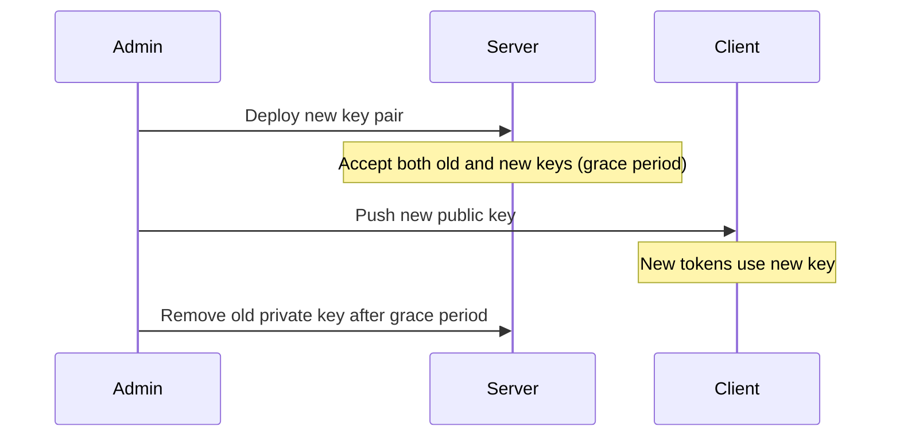

# Operations Runbook

## Key Generation

### Generate RSA Key Pair

```bash
make generate-keys
```

This creates `keys/private.pem` (2048-bit RSA) and `keys/public.pem`. The `keys/` directory is gitignored.

### Manual Key Generation

```bash
# Generate 2048-bit RSA private key
openssl genpkey -algorithm RSA -out keys/private.pem -pkeyopt rsa_keygen_bits:2048

# Extract public key
openssl rsa -pubout -in keys/private.pem -out keys/public.pem
```

### Programmatic Key Generation

```typescript
import { generateKeyPair, generateKeyPairAsync } from '@bolt-fraud/server'

// Synchronous
const keys = generateKeyPair()
// keys.publicKey, keys.privateKey (PEM strings)

// Async (non-blocking)
const keys = await generateKeyPairAsync()
```

## Key Rotation



1. Generate a new key pair
2. Deploy the new private key to the server alongside the old one
3. Update the client SDK config with the new public key
4. After sufficient rollover time (e.g., 24h), remove the old private key

## Configuration

### Environment Variables

| Variable | Required | Default | Description |
|----------|----------|---------|-------------|
| `RSA_PRIVATE_KEY_PATH` | Yes | - | Path to RSA private key PEM |
| `RSA_PUBLIC_KEY_PATH` | Yes | - | Path to RSA public key PEM |
| `BLOCK_THRESHOLD` | No | `70` | Score above which requests are blocked |
| `CHALLENGE_THRESHOLD` | No | `30` | Score above which requests get CAPTCHA |
| `REDIS_URL` | No | - | Redis URL for fingerprint history store |

### Scoring Thresholds

Tune thresholds based on your use case:

- **High security** (payments): `blockThreshold: 50, challengeThreshold: 20`
- **Default** (general API): `blockThreshold: 70, challengeThreshold: 30`
- **Lenient** (public content): `blockThreshold: 90, challengeThreshold: 50`

## Monitoring

### Key Metrics to Track

| Metric | What to Watch |
|--------|---------------|
| Block rate | Sudden spikes may indicate attack or false positives |
| Challenge rate | High rate may frustrate legitimate users |
| Score distribution | Bimodal (bots vs humans) is healthy; unimodal is concerning |
| Token decryption failures | Spikes indicate key mismatch or replay attacks |
| `instant_block` reasons | Which bot frameworks are targeting you |

### Decision Reasons

Monitor the `reasons` array in decisions. Common patterns:

- `token_decryption_failed` — Invalid/tampered token, key mismatch
- `token_timestamp_future` — Clock skew or replay attack
- `token_too_old` — Token older than 30s (replay or slow client)
- `instant_block:webdriver_present` — Selenium WebDriver detected
- `instant_block:puppeteer_runtime` — Puppeteer detected
- `no_interaction_events` — No mouse/keyboard activity (headless browser)
- `mouse_entropy_too_low` — Linear mouse paths (scripted movement)
- `canvas_fingerprint_empty_or_zero` — Headless/sandboxed environment

## Troubleshooting

### All Requests Blocked

1. **Check key configuration**: Ensure private key matches the public key used by clients
2. **Check token header**: Verify client sends `x-client-data` header
3. **Check thresholds**: May be too aggressive; try raising `blockThreshold`
4. **Check clock sync**: Token age check fails if server/client clocks differ by >30s

### High False Positive Rate

1. **Canvas/WebGL fingerprints empty**: Privacy extensions (Brave shields, Firefox ETP) can blank these. Lower the weight or exclude for known browser populations.
2. **No interaction events**: Mobile users or quick page loads may not generate enough events. Increase the collection window.
3. **Keystroke uniformity**: Power users with mechanical keyboards may trigger this. Raise the uniformity threshold.

### Token Decryption Failures

1. **Key mismatch**: Client public key doesn't match server private key
2. **Token corruption**: Proxy or CDN modifying the header value
3. **Base64url encoding**: Ensure the token is valid base64url (no padding, `-` and `_` chars)

### Memory Store Growing Unbounded

The in-memory `MemoryStore` does not evict entries. For production, implement `FingerprintStore` with Redis and TTL:

```typescript
import type { FingerprintStore } from '@bolt-fraud/server'
import Redis from 'ioredis'

class RedisStore implements FingerprintStore {
  constructor(private redis: Redis) {}

  async saveFingerprint(hash: string, ip: string): Promise<void> {
    await this.redis.sadd(`fp:${hash}:ips`, ip)
    await this.redis.expire(`fp:${hash}:ips`, 86400) // 24h TTL
  }

  async getIPCount(hash: string): Promise<number> {
    return this.redis.scard(`fp:${hash}:ips`)
  }
}
```

## Health Checks

The server package does not expose HTTP endpoints directly. Implement health checks in your application layer:

```typescript
app.get('/health', (req, res) => {
  res.json({ status: 'ok', boltFraud: 'active' })
})
```

Verify the scoring engine is functional by running a test token through `verify()` periodically.
