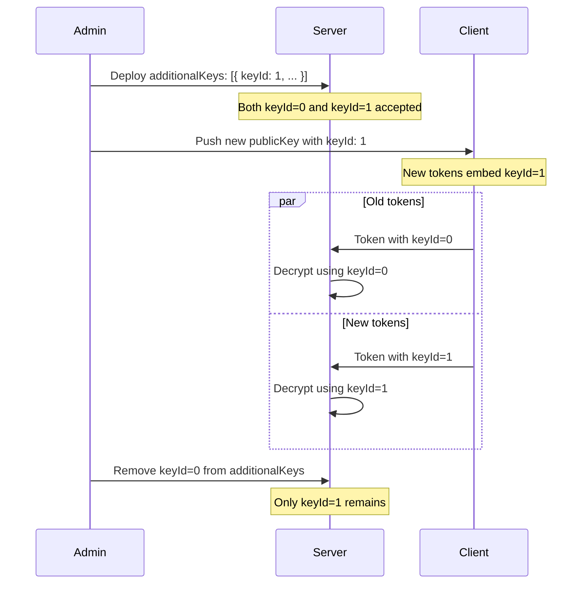

# Operations Runbook

## Key Generation

### Generate RSA Key Pair

```bash
make generate-keys
```

This creates `keys/private.pem` (2048-bit RSA) and `keys/public.pem`. The `keys/` directory is gitignored.

### Manual Key Generation

```bash
# Generate 2048-bit RSA private key
openssl genpkey -algorithm RSA -out keys/private.pem -pkeyopt rsa_keygen_bits:2048

# Extract public key
openssl rsa -pubout -in keys/private.pem -out keys/public.pem
```

### Programmatic Key Generation

```typescript
import { generateKeyPair, generateKeyPairAsync } from '@bolt-fraud/server'

// Synchronous
const keys = generateKeyPair()
// keys.publicKey, keys.privateKey (PEM strings)

// Async (non-blocking)
const keys = await generateKeyPairAsync()
```

## Key Rotation

Key rotation allows seamless updates without downtime or client synchronization issues.



**Step-by-step procedure**:

1. Generate a new RSA key pair:
   ```bash
   openssl genpkey -algorithm RSA -out keys/private-v2.pem -pkeyopt rsa_keygen_bits:2048
   openssl rsa -pubout -in keys/private-v2.pem -out keys/public-v2.pem
   ```

2. Deploy server with both keys in `additionalKeys`:
   ```typescript
   const bf = createBoltFraud({
     privateKeyPem: oldPrivateKey,  // keyId=0 (default)
     publicKeyPem: oldPublicKey,
     additionalKeys: [
       { keyId: 1, publicKeyPem: newPublicKey, privateKeyPem: newPrivateKey }
     ]
   })
   ```

3. Update client SDK to use the new key:
   ```typescript
   await init({
     serverUrl: 'https://api.example.com',
     publicKey: newPublicKey,
     keyId: 1  // Embed in token header
   })
   ```

4. Monitor logs for successful decryption with both keys.

5. After grace period (24-48 hours), remove the old key:
   ```typescript
   const bf = createBoltFraud({
     privateKeyPem: newPrivateKey,
     publicKeyPem: newPublicKey,
     // additionalKeys removed — only new key remains
   })
   ```

> Note: Tokens encrypted with the old key are no longer decryptable. Ensure client rollout is complete before removing the old key.

## Configuration

### Server Configuration

```typescript
interface BoltFraudServerConfig {
  privateKeyPem?: string                    // Private key for keyId=0 (optional in dev)
  publicKeyPem?: string                     // Public key for keyId=0
  blockThreshold?: number                   // Default: 70
  challengeThreshold?: number               // Default: 30
  store?: FingerprintStore                  // Optional IP reputation + nonce store
  additionalKeys?: Array<{                  // For key rotation
    keyId: number
    publicKeyPem: string
    privateKeyPem: string
  }>
}
```

### Environment Variables

| Variable | Required | Default | Description |
|----------|----------|---------|-------------|
| `RSA_PRIVATE_KEY` | Yes | - | RSA private key PEM (or read from file) |
| `RSA_PUBLIC_KEY` | Yes | - | RSA public key PEM (or read from file) |
| `BLOCK_THRESHOLD` | No | `70` | Score ≥ this value triggers block |
| `CHALLENGE_THRESHOLD` | No | `30` | Score ≥ this value triggers challenge |
| `REDIS_URL` | No | - | Redis URL for fingerprint store (optional) |

### Client Configuration

```typescript
interface BoltFraudConfig {
  serverUrl: string                         // Required: API base URL
  publicKey?: string                        // RSA public key PEM (dev: optional)
  keyId?: number                            // Default: 0 (which key to use)
  hookFetch?: boolean                       // Default: true
  hookXHR?: boolean                         // Default: false
  tokenHeader?: string                      // Default: 'x-client-data'
  collectInterval?: number                  // Fingerprint collection interval (ms)
  ringBufferSize?: number                   // Behavior history size
  protectedPatterns?: RegExp[]              // URL patterns requiring tokens
  onTokenReady?: (token: EncryptedToken) => void
  onError?: (error: Error) => void
}
```

### Scoring Thresholds

Tune thresholds based on your use case:

- **High security** (payments): `blockThreshold: 50, challengeThreshold: 20`
- **Default** (general API): `blockThreshold: 70, challengeThreshold: 30`
- **Lenient** (public content): `blockThreshold: 90, challengeThreshold: 50`

## Monitoring

### Key Metrics to Track

| Metric | What to Watch |
|--------|---------------|
| Block rate | Sudden spikes may indicate attack or false positives |
| Challenge rate | High rate may frustrate legitimate users |
| Score distribution | Bimodal (bots vs humans) is healthy; unimodal is concerning |
| Token decryption failures | Spikes indicate key mismatch or replay attacks |
| `instant_block` reasons | Which bot frameworks are targeting you |

### Decision Reasons

Monitor the `reasons` array in decisions. Common patterns:

- `token_decryption_failed` — Invalid/tampered token, key mismatch
- `token_timestamp_future` — Clock skew or replay attack
- `token_too_old` — Token older than 30s (replay or slow client)
- `token_nonce_replayed` — Same nonce seen within 60s window (replay attack)
- `token_expired` — Token older than 5 minutes (instant block)
- `instant_block:webdriver_present` — Selenium WebDriver detected
- `instant_block:puppeteer_runtime` — Puppeteer detected
- `no_interaction_events` — No mouse/keyboard activity (headless browser)
- `mouse_entropy_too_low` — Linear mouse paths (scripted movement)
- `canvas_fingerprint_empty_or_zero` — Headless/sandboxed environment

## Custom Scorers

Extend the risk engine with domain-specific scoring logic:

```typescript
import { RiskEngine, type Scorer, type ScorerResult } from '@bolt-fraud/server'

class GeoIPScorer implements Scorer {
  readonly name = 'geo'
  score(token, context) {
    if (!context.clientIP) return { score: 0, reasons: [] }

    const country = geoipLookup(context.clientIP)
    if (!allowedCountries.has(country)) {
      return { score: 20, reasons: ['geo_blocked_country'] }
    }
    return { score: 0, reasons: [] }
  }
}

const engine = new RiskEngine({
  scorers: [
    // Built-in scorers...
    new GeoIPScorer()
  ]
})
```

**Best practices**:
- Keep scorer logic simple and fast (avoid blocking operations)
- Return descriptive reason strings for monitoring
- Use `instantBlock: true` sparingly (reserved for high-confidence signals)
- Consider async operations (scorer can return Promise<ScorerResult>)

## Troubleshooting

### All Requests Blocked

1. **Check key configuration**: Ensure private key matches the public key used by clients
2. **Check token header**: Verify client sends `x-client-data` header (default: `x-client-data`)
3. **Check thresholds**: May be too aggressive; try raising `blockThreshold` to 80
4. **Check clock sync**: Token age check fails if server/client clocks differ by >30s

### High False Positive Rate

1. **Canvas/WebGL fingerprints empty**: Privacy extensions (Brave shields, Firefox ETP) can blank these. Lower the weight or exclude for known browser populations.
2. **No interaction events**: Mobile users or quick page loads may not generate enough events. Increase the collection window.
3. **Keystroke uniformity**: Power users with mechanical keyboards may trigger this. Raise the uniformity threshold.

### Token Decryption Failures

1. **Key mismatch**: Client public key doesn't match server private key. Check that `publicKey` in client config matches the PEM deployed on server.
2. **keyId mismatch**: Client sends `keyId` that server doesn't have in `additionalKeys`. Verify key rotation is complete.
3. **Token corruption**: Proxy or CDN modifying the header value. Check raw HTTP headers in logs.
4. **Base64url encoding**: Token must be valid base64url (no padding, using `-` and `_` chars). Verify no URL encoding applied twice.
5. **Payload size**: Token exceeds 64 KB compressed limit. Check `MAX_TOKEN_SIZE` constant in `decrypt.ts`.

### Memory Store Growing Unbounded

The in-memory `MemoryStore` does not evict entries. For production, implement `FingerprintStore` with Redis and TTL:

```typescript
import type { FingerprintStore } from '@bolt-fraud/server'
import Redis from 'ioredis'

class RedisStore implements FingerprintStore {
  constructor(private redis: Redis) {}

  async saveFingerprint(hash: string, ip: string): Promise<void> {
    await this.redis.sadd(`fp:${hash}:ips`, ip)
    await this.redis.expire(`fp:${hash}:ips`, 86400) // 24h TTL
  }

  async getIPCount(hash: string): Promise<number> {
    return this.redis.scard(`fp:${hash}:ips`)
  }
}
```

## Health Checks

The server package does not expose HTTP endpoints directly. Implement health checks in your application layer:

```typescript
app.get('/health', (req, res) => {
  res.json({ status: 'ok', boltFraud: 'active' })
})
```

Verify the scoring engine is functional by running a test token through `verify()` periodically.
